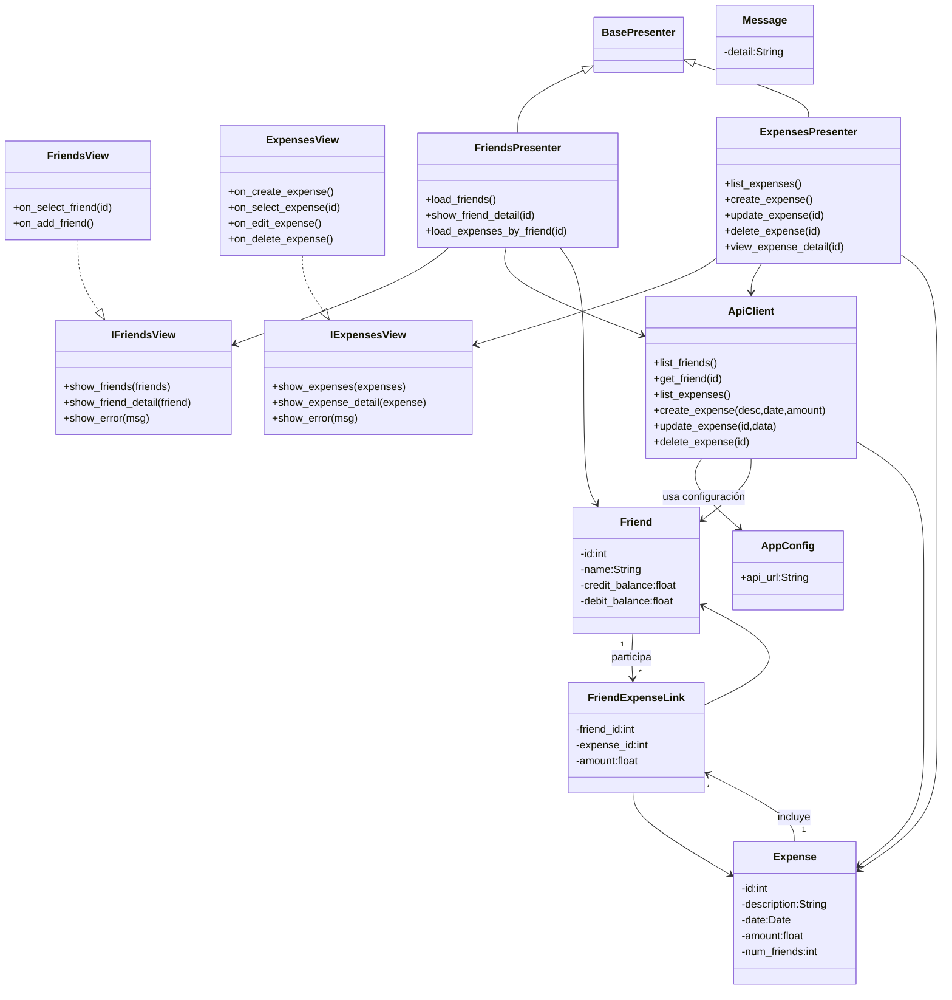
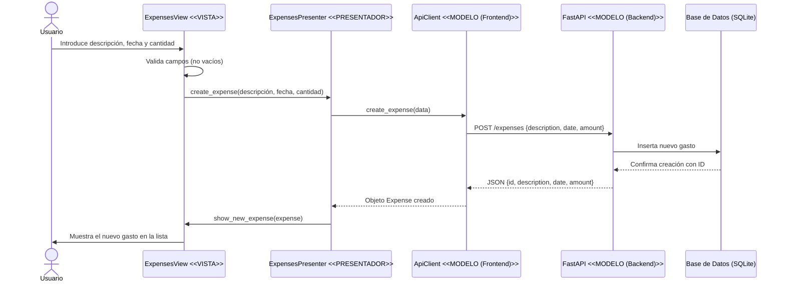

# Diseño Software — SplitWithMe (Patrón MVP)

## 1. Introducción
El presente diseño software sigue el patrón **Modelo–Vista–Presentador (MVP)**. 
Se incluyen los diagramas UML de la parte **estática** (estructura de clases) 
y la parte **dinámica** (interacción entre objetos) para cubrir los **CU1–CU11** definidos.

---

## 2. Diagrama estático (UML de clases)

---

## 3. Diagrama dinámico (UML de secuencia — Caso de uso “Crear gasto”)

---

## 4. Trazabilidad Casos de Uso → Clases

| CU | Vista | Presentador | Modelo |
|----|--------|--------------|---------|
| CU1–CU3 | FriendsView | FriendsPresenter | ApiClient, Friend, FriendExpenseLink |
| CU4–CU11 | ExpensesView | ExpensesPresenter | ApiClient, Expense, Friend, FriendExpenseLink |

---

## 5. Conclusión
El diseño propuesto sigue el patrón MVP, garantizando separación entre la interfaz (Vista), la lógica de control (Presentador) y la lógica de negocio (Modelo). 
Permite implementar todos los casos de uso definidos y mantener un acoplamiento bajo entre las capas.
