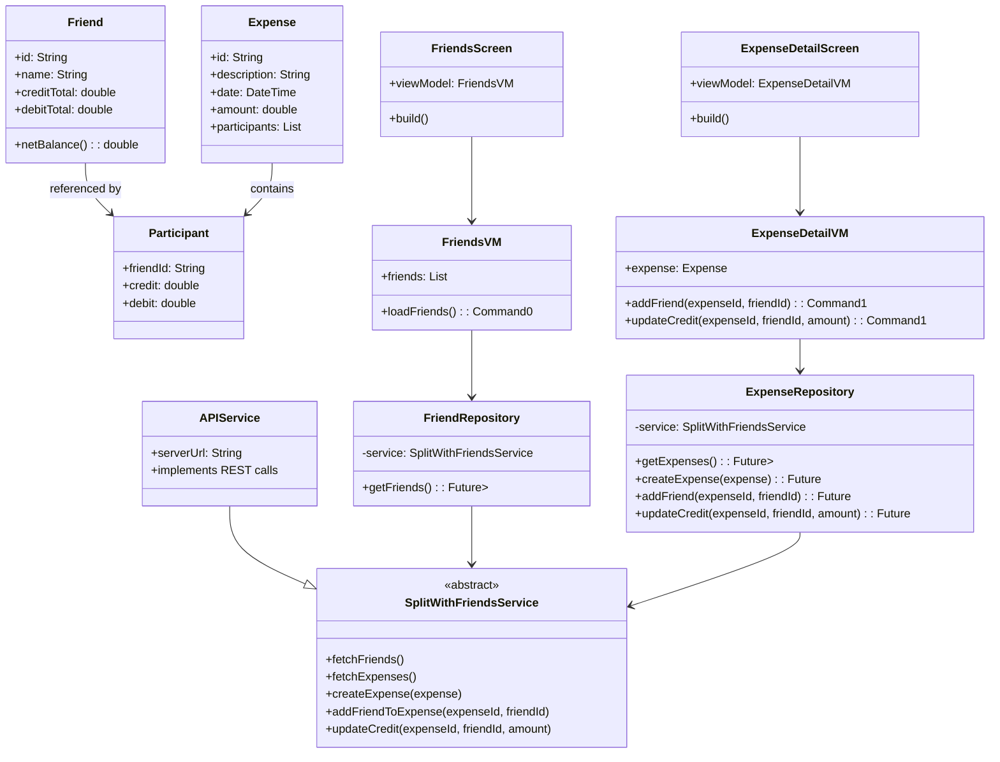
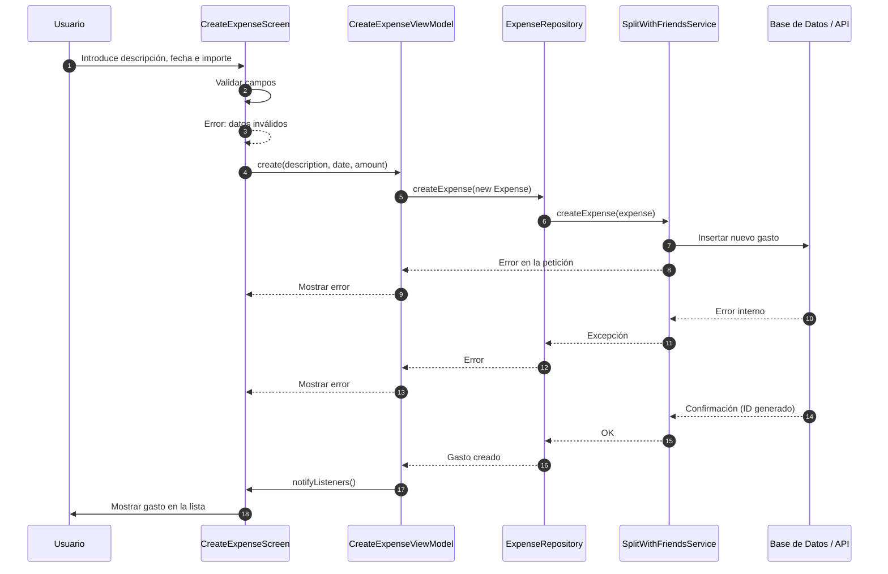

# Diseño Software — SplitWithFriends (Patrón MVVM)

## 1. Introducción

El presente diseño software sigue el patrón arquitectónico **Modelo–Vista–ViewModel (MVVM)**.  
Este patrón permite **separar claramente la interfaz de usuario, la lógica de interacción y el acceso a datos**, evitando dependencias innecesarias y facilitando el mantenimiento.

---

## 2. Diagrama estático (UML de clases)

---

## 3. Diagrama dinámico (UML de secuencia — Caso de uso “Crear gasto”)

---

## 4. Conclusión

Se utiliza el patrón **MVVM** porque:
- Separa de forma efectiva **UI**, **lógica de negocio** y **acceso a datos**.
- Permite que las **vistas sean simples y reactivas**, reaccionando automáticamente a los cambios de estado.
- La lógica permanece en la **ViewModel**, lo que facilita las **pruebas unitarias**.
- Los **repositorios** aíslan la fuente de datos, lo que permite intercambiar API, mocks o almacenamiento local sin modificar la UI.

Este diseño es **mantenible, escalable y adecuado** para aplicaciones móviles desarrolladas con Flutter.

